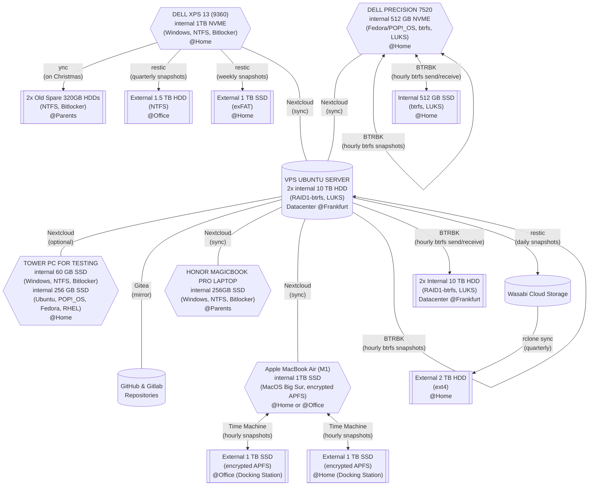


**This post serves as a mental note to me (and my relatives) about my backup strategy. Of course, this is work-in-progress and not perfect, so I will update this post from time to time. Any comments, questions, and suggestions are much appreciated.**

**The exact commands and scripts I use are given in [this Github repository](https://github.com/wmutschl/scripts).**

## Challenges
Spring is here and I have taken this as an opportunity to sort out my backup strategy for the various machines I take care of. One difficulty is definitely that the computers run different operating systems (Linux, MacOS, Windows). Some computers I don't use regularly (like my wife's laptop) and some I don't use at all (like my parent's laptop). My goal is to have both snapshots of data so one can go back in time, but also to have several layers of redundancy and some safe-nets just in case. Moreover, I want to store my backups at different locations like at home, at the office, at my parents house and also in the cloud. So these are more-or-less the challenges.

Luckily, I own a VPS (in a datacenter in Frankfurt) with (almost) unlimited storage, so I use it extensively to keep my machines in sync and to create automatic incremental snapshots and backups. I also had a look in the closet (inside those boxes labeled *tech*) to find quite a number of external USB disks (both SSD and HDD) and also some old internal HDD disks, which - instead of just throwing them away - I use as additional offside backups and safe-nets. Lastly, I also like to keep a copy/mirror and backup of my repositories from GitHub and Gitlab.

## Overview
Here is a graphical overview of my backup strategy (I used mermaid for the diagram, you might need to refresh your browser several times to make it appear):



The most important piece of my backup strategy is Nextcloud which runs on my Ubuntu Server VPS (located in a datacenter in Frankfurt). On the one hand, this enables me to sync data between machines (which is one layer of redundancy) but if I mess up on one machine this will spread to all of my machines. So on the other hand, I take incremental hourly snapshots and backups of all data on the VPS. With this I can restore data from different points in time which is very important as corrupt files or malware stays often undetected for quite some time. The VPS itself has two disks and I combine these into RAID1 managed by the filesystem btrfs. I then create two partitions, one for the system and services, and the other one as send/receive target for the backups. Due to RAID1 managed by btrfs, I can do a monthly scrub of my data to find inconsistencies and (if there are any) btrfs will correct these automatically. This is also useful for backing up of my git repositories from GitHub and Gitlab. For this I use Gitea to mirror my repositories and due to the hourly snapshots on the VPS these get a continuous backup as well.

I do have several other backups and redundancies due to machines being backed up to external disks, which I also keep at different locations. Ideally, this happens automatically, if there is another internal disk in the computer or if the external disks are always connected to a docking station. Otherwise, one needs to manually connect the external disks on a regular schedule and run the backup. So for this I have created reminders in my calendar that keep bugging me to do a backup.

Nevertheless if all my machines, the VPS, and all external disks at all different locations brake or burn down simultaneously, I have one last backup as I keep (encrypted) snapshots of my data on a paid (but cheap) cloud storage plan of Wasabi. Of course, it is of uttermost importance to regularly check the integrity of the data. Therefore, every 3 months, I sync all data of Wasabi to a dedicated external HDD drive using `rclone`. While the data (about 1TB) downloads I validate my other backups, by going randomly through folders (particularly the most important ones) and opening documents and pictures. When the download finishes I do a `restic -r MYREPO check --read-data` on the dedicated external HDD drive. Afterwards I open the latest snapshot and go through the most important files and folders.

    
## Machines and Tools
With that said, let's take a closer look at the machines I care about and tools I use for backup.

### 1. VPS (Ubuntu Server)
I got lucky and purchased a VPS with (almost) unlimited storage. The VPS has two very large luks-encrypted 20TB disks and I partitioned them in the following way:
- two system partitions for btrfs snapshots
  - vda2 and vdb2 are both encrypted with luks and mapped to data_vda and data_vdb
  - data_vda and data_vdb are formatted with btrfs and put into a RAID1 managed by btrfs
  - This is then used for the system files, i.e. / is mounted to a subvolume called @ and /home is mounted to a subvolume called @home
  - I create hourly btrfs snapshots using BTRBK
- two target partitions for btrfs send/receive 
  - vda3 and vdb3 are both encrypted with luks and mapped to backup_vda and backup_vdb
  - backup_vda and backup_vdb are formatted with btrfs and put into a RAID1 managed by btrfs
  - This is then used as the target for btrfs send/receive operations using BTRBK

Basically, I run several docker containers ([SWAG](https://docs.linuxserver.io/general/swag), [Nextcloud](https://github.com/nextcloud/docker), [Gitea](https://docs.gitea.io/en-us/install-with-docker/)) using a single docker-compose file and some scripts for automatic snapshots and backups.

My backup strategy:
  1. continuous sync of user data from different machines to this VPS using *Nextcloud* (*automatic*)
  2. continuous mirroring of repositories from GitHub and Gitlab to this VPS using *Gitea* (*automatic*)
  3. hourly, daily, weekly and monthly btrfs snapshots on system partitions using *BTRBK* (*automatic*)
  4. hourly, daily, weekly and monthly btrfs send/receive of snapshots to the internal backup partitions using *BTRBK* (*automatic*)
  5. daily snapshots to Wasabi cloud storage using *restic* (*automatic*)

Note that all machines sync data to this VPS so I really care about the integrity of the data and maintenance of the VPS and of Nextcloud. Therefore I run two btrfs maintenance tasks (a weekly balance and a monthly scrub) and a daily maintenance task for Nextcloud. Moreover, I heavily rely on [healthchecks.io](https://healthchecks.io) to monitor my server and outcome of the scripts and tools I use within my backup strategy. As all items on the backup strategy need to run automatically, I use cron for that. The exact commands and scripts I use are given in [this Github repository](https://github.com/wmutschl/scripts).

### 2. Wasabi Cloud Storage
My overall data usage on my VPS tends to be below 1.5 TB, so I find Wasabi quite cheap as a **backup location of last resort**.  Every three months I check the integrity of my backup on Wasabi by syncing it to an external 2TB HDD (ext4 formatted) drive using [rclone sync](https://rclone.org/s3/#wasabi):
```sh
rclone --config $HOME/scripts/wasabi-rclone.conf sync wasabi:$WASABI_BUCKET /media/$USER/$EXTERNAL_HDD/$WASABI_BUCKET -P
```
As a neat by-product, I have snapshots of my server (and therefore of all other machines) on this external HDD. Every six months I also run some maintenance tasks on Wasabi to prune the snapshots. The exact commands, configuration files and scripts I use are given in [this Github repository](https://github.com/wmutschl/scripts).

### 3. Apple MacBook Air M1 (MacOS BigSur)
This is my main machine running MacOS Big Sur on a 1 TB drive (encrypted APFS). I use Nextcloud to sync data between this machine, the Dell XPS, and my Dell Precision.

My backup strategy: 
  1. continuous sync of user data to the VPS using *Nextcloud* (*automatic*)
  1. hourly snapshots using *Time-Machine* to an external 1TB SSD (Samsung T5 Portable formatted with encrypted APFS) which is always connected to my home docking station (*automatic*)
  1. hourly snapshots using *Time-Machine* to an external 1TB SSD (Samsung T5 Portable formatted with encrypted APFS) which is always connected to my office docking station (*automatic*)
  
Time-Machine is very easy to use and as the external disks are always connected to the docking stations, the backups are done automatically. Moreover, they are located at two different locations, so this is quite perfect. I would also like to use an external storage like my VPS or Wasabi for yet another Time-Machine backup, so if you know how to set this up, let me know!

### 4. Dell XPS 13 9360 (Windows)
This is our home laptop running Windows 10 on a 1TB NVME drive (NTFS encrypted with Bitlocker). This machine is mainly used by my wife, but I also have an account to sync my data between this machine, the Dell Precision, and my MacBook Air.

My backup strategy: 
  1. continuous sync of user data to the VPS using *Nextcloud* (*automatic*)
  1. weekly snapshots on Friday to an external 1TB SSD (Samsung T7 Portable formatted with exFAT, stays at home) using *restic* (*manual*)
  1. quarterly snapshots to an (old) external 1.5TB HDD drive (formated with NTFS, stays at office) using *restic* (*manual*)
  1. on Christmas (when I visit my parents) I copy the most important user data to two (very old internal) 320GB HDD drive (NTFS encrypted with Bitlocker, stays at my parent's house) using *rsync* (*manual*)

I am aware that both the old external and the old internal HDDs have some risk of failure. But so far, because I am only accessing them periodically, I did not see any corrupted data (yet) and will keep using them with care as a safe-net until they start breaking. The exact commands for restic and rsync (and a list of files and folders to ignore) is given in [this Github repository](https://github.com/wmutschl/scripts).

### 5. Dell Precision 7520 (Linux)
This is my former main machine running either Fedora or Pop!_OS on a 512 GB internal NVME drive (btrfs encrypted with LUKS). The machine also has another internal 512GB SSD drive (btrfs encrypted with LUKS). I use Nextcloud to sync data between this machine, the Dell XPS, and my MacBook Air.

My backup strategy: 
  1. continuous sync of user data to the VPS using *Nextcloud* (*automatic*)
  1. hourly, daily, weekly and monthly btrfs snapshots using *BTRBK* (*automatic*)
  1. hourly, daily, weekly and monthly btrfs send/receive snapshots to the internal 512GB SSD drive using *BTRBK* (*automatic*)

The exact configuration file and systemd timer for BTRBK are given in [this Github repository](https://github.com/wmutschl/scripts).

### 6. Honor Magicbook Pro (Windows)
This is my parent's laptop running Windows 10 on a 256 GB SSD drive (NTFS encrypted with Bitlocker). I don't have access to this machine, but want to make sure that my parent's data is safe. 

My backup strategy: 
  1. continuous sync of user data to the VPS using *Nextcloud* (*automatic*)
  
I am aware that this needs some more redundancy. Maybe I will buy/find another external disk for backups or a very small usb thumbdrive that can stay plugged-in and do automatic backups. But as long as my VPS is regularly backed up locally as well as to Wasabi, this is good enough.

### 7. Tower PC (Windows & Linux)
I built this machine from spare parts and use it exclusively for testing purposes. The PC has two internal disks: on the 60GB SSD drive (NTFS encrypted with Bitlocker) I've installed Windows 10; whereas on the 256GB SSD drive I try out different Linux distros, filesystems and encryption methods. If I need to sync user data from my main machines (very rarely and usually non-sensitive), I use *Nextcloud* on the VPS to sync selected folders between this machine and my laptops.

My backup strategy: I don't care about the data on this machine.

### 8. GitHub and Gitlab
I use [Gitea](https://docs.gitea.io) to mirror all my repositories to my VPS. As I take automatic and regular snapshots of the VPS, my repositories are also saved in case GitHub or Gitlab goes down. Every three months I go through all my repositories and check whether they are correctly mirrored and if I need to add other repositories as well.

