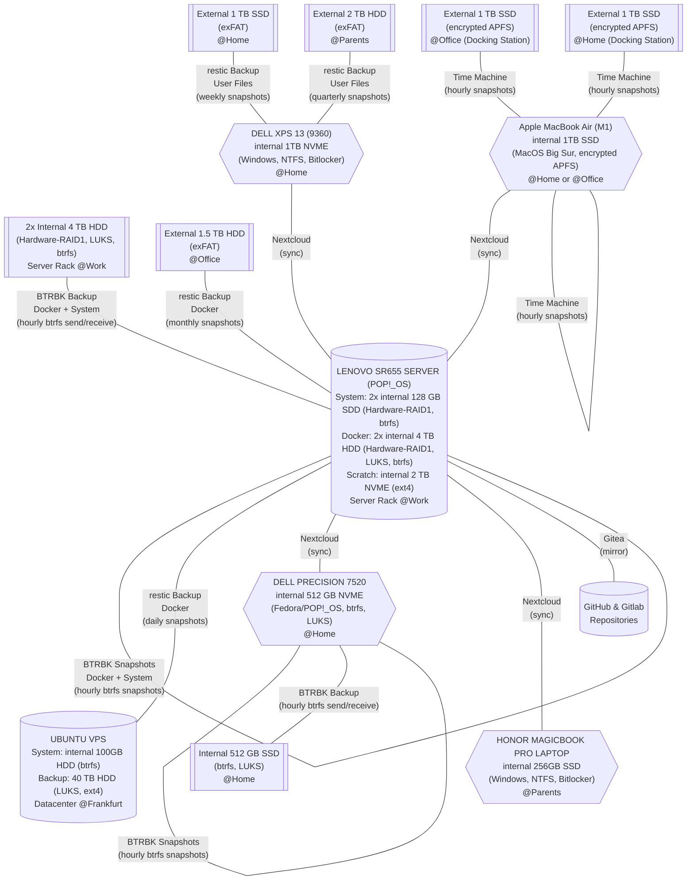


**This post serves as a mental note to me (and my relatives) about my backup strategy. Of course, this is work-in-progress and not perfect, so I will update this post from time to time. Any comments, questions, and suggestions are much appreciated.**

**The exact commands and scripts I use are given in [this GitHub repository](https://github.com/wmutschl/scripts).**

## Challenges
The year 2022 just started and and I have taken this as an opportunity to improve my backup strategy for the various machines I take care of. One difficulty is definitely that the computers run different operating systems (Linux, macOS, Windows). Some computers I don't use regularly (like my wife's laptop) and some I don't use at all (like my parent's laptop). My goal is to have both snapshots of data so one can go back in time, but also to have several layers of redundancy and some safe-nets just in case. Moreover, I want to store my backups at different locations like at home, at the office, at my parents house and also in the cloud. So these are more-or-less the challenges. Lastly, I also like to keep a copy/mirror and backup of my repositories from GitHub and Gitlab. Luckily, I have access to both a very powerful server (in a data rack at my university) and a VPS with 40 TB of storage, so I am able to overcome these challenges in order to keep all the machines both in sync but also to create automatic incremental snapshots and backups not only locally but also off-side.

## Overview
Here is a graphical overview of my backup strategy (I used mermaid for the diagram, you might need to refresh your browser several times to make it appear):

The most important piece of my backup strategy is Nextcloud which runs on my Lenovo SR655 server that I use for research purposes (located in a data rack at my university, but I have total admin access to it). This enables me to sync data between machines (which is one layer of redundancy); however, if I mess something up on one machine this will spread to all of my other machines. Therefore, I take incremental hourly snapshots and backups of all data on the server. With this I can restore data for all of my machines from different points in time, which is very important as corrupt files or malware stays often undetected for quite some time. I run a full-blown POP!_OS install on my server to be able to access it via remote desktop in order to do my research (estimations and simulations) on it. The system is installed on two 128 GB SSDs, formatted with btrfs for automatic snapshots, and set up as RAID1 by a Hardware RAID controller. I run my research on a very fast 2 TB NVME drive (no RAID required, formatted with ext4) as this is used for intermediate stuff). Moreover, the server has 4x4TB HDD drives, which I use for my Docker services and backups. To this end, I put 2 drives in RAID1 using the Hardware controller, format it with btrfs for easy snapshots and backups. I use Docker to run [Nextcloud](https://github.com/linuxserver/docker-nextcloud) and [Gitea](https://docs.gitea.io/en-us/install-with-docker/) behind a [SWAG](https://docs.linuxserver.io/general/swag) reverse proxy. My git repositories from GitHub and Gitlab are mirrored to Gitea. The other 2 drives are also in RAID 1, managed by the Hardware controller and formatted with btrfs. These two drives serve as the target for the btrfs send and receive backups. Particularly, I backup my system, home and docker subvolumes. I do a monthly btrfs scrub and weekly btrfs balance of my data to find inconsistencies and clean-up the filesystem.

I do have several other backups and redundancies due to machines being backed up to external disks, which I also keep at different locations. Ideally, this happens automatically if there is another internal disk in the computer or if the external disks are always connected to a docking station. Otherwise, one needs to manually connect the external disks on a regular schedule and run the backup. So for this I have created reminders in my To-Do app that keep bugging me to do the backups.

Nevertheless if all my machines, the server, and all external disks at all different locations brake or burn down simultaneously, I have one last backup as I keep (encrypted) snapshots of my data on a VPS located in a data center in Frankfurt. The VPS is very slow, but offers 40TB of storage, so I do daily snapshots of my server using restic and upload them to the VPS. 
    
## Machines and Tools
With that said, let's take a closer look at the machines I care about and tools I use for backup.

### Lenovo SR655 server
For my research I have full admin access to a server located in a server rack at my university. The server can handle easily my backups and sync of data between machines. The server has 7 disks:
- 2x128 GB SSD used for the operating system. The disks are in a Hardware-RAID1 and formatted with btrfs. `\` and `\home` are mounted to, respectively, btrfs subvolumes `@` and `@home`. I create hourly btrfs snapshots using BTRBK.
- 1x2 TB NVME used as a scratch partition for my research, formatted with ext4. I also mount `/var/lib/docker` to this drive as I find that docker works better on ext4 than on btrfs. I don't really care about the data on this drive. The drive is mounted to to `$HOME/scratch`.
- 2x4 TB HDD used for the data of my docker services ([Nextcloud](https://github.com/linuxserver/docker-nextcloud), [Gitea](https://docs.gitea.io/en-us/install-with-docker/), [SWAG](https://docs.linuxserver.io/general/swag)). The disks are in a Hardware-RAID1 which is then encrypted with LUKS and formatted with btrfs. I mount a subvolume called `@` to `$HOME/docker` and create hourly btrfs snapshots using BTRBK.
- 2x4 TB HDD used as a target device for btrfs send-receive backups of the subvolumes of the other disks (`@`, `@home` and `@docker`) using BTRBK. The two disks are in a Hardware-RAID1 and encrypted with LUKS. I don't create btrfs subvolumes here, but simply send and receive the other subvolumes to the top-level of this device.

My backup strategy:
  1. continuous sync of user data from different machines to this server using *Nextcloud* (*automatic*)
  2. continuous mirroring of repositories from GitHub and Gitlab to this server using *Gitea* (*automatic*)
  3. hourly, daily, weekly and monthly btrfs snapshots of `@`, `@home` and `@docker` using *BTRBK* (*automatic*)
  4. hourly, daily, weekly and monthly btrfs send/receive of snapshots of `@`, `@home` and `@docker` to the internal backup devices using *BTRBK* (*automatic*)
  5. daily snapshots to my [VPS](#vps-ubuntu-server) using *restic* (*automatic*)
  6. monthly snapshots to an older external 1.5TB harddisk (formatted with exFAT) using *restic* (*manual*)

Note that all machines sync data to this VPS so I really care about the integrity of the data and maintenance of the server and of Nextcloud. Therefore I run two btrfs maintenance tasks (a weekly balance and a monthly scrub) and a daily maintenance task for Nextcloud. Moreover, I heavily rely on [healthchecks.io](https://healthchecks.io) to monitor my server and outcome of the scripts and tools I use within my backup strategy. As all items on the backup strategy need to run automatically, I use cron for that. I do have one manual task for which I have a monthly reminder in my To Do app. The exact commands and scripts I use are given in [this GitHub repository](https://github.com/wmutschl/scripts).

### Apple MacBook Air M1 (macOS BigSur)
This is my main machine running macOS Monterey on a 1 TB drive (encrypted APFS). I use Nextcloud to sync data between this machine, the Dell XPS, and my Dell Precision.

My backup strategy: 
  1. continuous sync of user data to my [server](#lenovo-sr655-server) using *Nextcloud* (*automatic*)
  2. hourly snapshots using *Time Machine* on the interal 1TB NVME (if there is space) (*automatic*)
  3. hourly snapshots using *Time Machine* to an external 1TB SSD (Samsung T5 Portable formatted with encrypted APFS) which is always connected to my home docking station (*automatic*)
  4. hourly snapshots using *Time Machine* to an external 1TB SSD (Samsung T5 Portable formatted with encrypted APFS) which is always connected to my office docking station (*automatic*)
  
Time Machine is very easy to use and as the external disks are always connected to the docking stations, the backups are done automatically. Moreover, they are located at two different locations, so this is quite perfect.

### Dell XPS 13 9360 (Windows)
This is our home laptop running Windows 10 on a 1TB NVME drive (NTFS encrypted with Bitlocker). This machine is mainly used by my wife, but I also have an user account to sync my data between this machine, the Dell Precision, and my MacBook Air.

My backup strategy: 
  1. continuous sync of user data to my [server](#lenovo-sr655-server) using *Nextcloud* (*automatic*).
  1. weekly snapshots on Friday to an external 1TB SSD (Samsung T7 Portable formatted with exFAT, stays at home) using *restic* (*manual*).
  1. quarterly snapshots to an external 2 TB HDD (formatted with exFAT) which is located at my parents house. I need to remind my parents to bring it with them when they visit. The snapshots are done with *restic* (*manual*).

The exact commands for restic and particularly the exclude file for Windows is given in [this GitHub repository](https://github.com/wmutschl/scripts).

### Dell Precision 7520 (Linux)
This is my former daily driver and I use it for certain development work and research that requires a Linux system. The machine runs either Fedora or Pop!_OS (I can't decide) on a 512 GB internal NVME drive (btrfs encrypted with LUKS). Again, I use Nextcloud to sync data between this machine, the Dell XPS, and my MacBook Air. The machine also has another internal 512GB SSD drive (btrfs encrypted with LUKS) which is used for btrfs send-receive backups.

My backup strategy: 
  1. continuous sync of user data to my [server](#lenovo-sr655-server) using *Nextcloud* (*automatic*)
  1. hourly, daily, weekly and monthly btrfs snapshots using *BTRBK* (*automatic*)
  1. hourly, daily, weekly and monthly btrfs send/receive snapshots to the internal 512GB SSD drive using *BTRBK* (*automatic*)

The exact configuration file and systemd timer for BTRBK are given in [this GitHub repository](https://github.com/wmutschl/scripts).

### Honor Magicbook Pro (Windows)
This is my parent's laptop running Windows 10 on a 256 GB SSD drive (NTFS encrypted with Bitlocker). I don't have access to this machine, but want to make sure that my parent's data is safe. 

My backup strategy: 
  1. continuous sync of user data to my [server](#lenovo-sr655-server) using *Nextcloud* (*automatic*)
  
I am aware that this needs some additional redundancy. Maybe I will buy/find another external disk for backups or a very small usb thumbdrive that can stay plugged-in and do automatic backups to it. But as long as my VPS is regularly backed up locally as well as offsite, this is good enough. Also, in this way my parents have incremental snapshots of their data on my server.

### GitHub and Gitlab
I use [Gitea](https://docs.gitea.io) on my [server](#lenovo-sr655-server) to version my research codes and data (which often exceeds the size limits of GitHub and Gitlab) and some additional private repos. Moreover, I mirror all my repositories from GitHub and Gitlab. As I take automatic and regular snapshots of the server, my repositories are also saved in case GitHub or Gitlab goes down (yeah right ;-)). Every three months, I have a reminder in my To-Do app to go through all my repositories and check whether they are correctly mirrored and if I need to add new repositories as well.

### VPS (Ubuntu Server)
I got lucky and purchased (some time ago) a VPS with two HDD disks (100 GB and 40 TB). I partition and use them in the following way:
- the smaller 100GB disk is used for the operating system. The disk is formatted with btrfs; `\` and `\home` are mounted to, respectively, btrfs subvolumes `@` and `@home`. I create hourly btrfs snapshots using [Timeshift](https://github.com/teejee2008/timeshift) and [Timeshift-autosnap-apt](https://github.com/wmutschl/timeshift-autosnap-apt). This is just in case some updates go wrong; I don't really care about these snapshots as this is a very basic Ubuntu Server install.
- the large 40TB disk is encrypted with luks and I format it with ext4. This disk is used for the daily snapshots of my [server](#lenovo-sr655-server) using *restic* (*automatic*)

I plan to deploy [MinIO](https://hub.docker.com/r/minio/minio/) on this server as restic works very well with block storage. Previously, I used a cheap plan for Wasabi to do that, which worked great.

As a neat by-product, I have snapshots of my server (and therefore of all other machines) on this external HDD. Every six months I also run some maintenance tasks on Wasabi to prune the snapshots. The exact commands, configuration files and scripts I use are given in [this Github repository](https://github.com/wmutschl/scripts).
